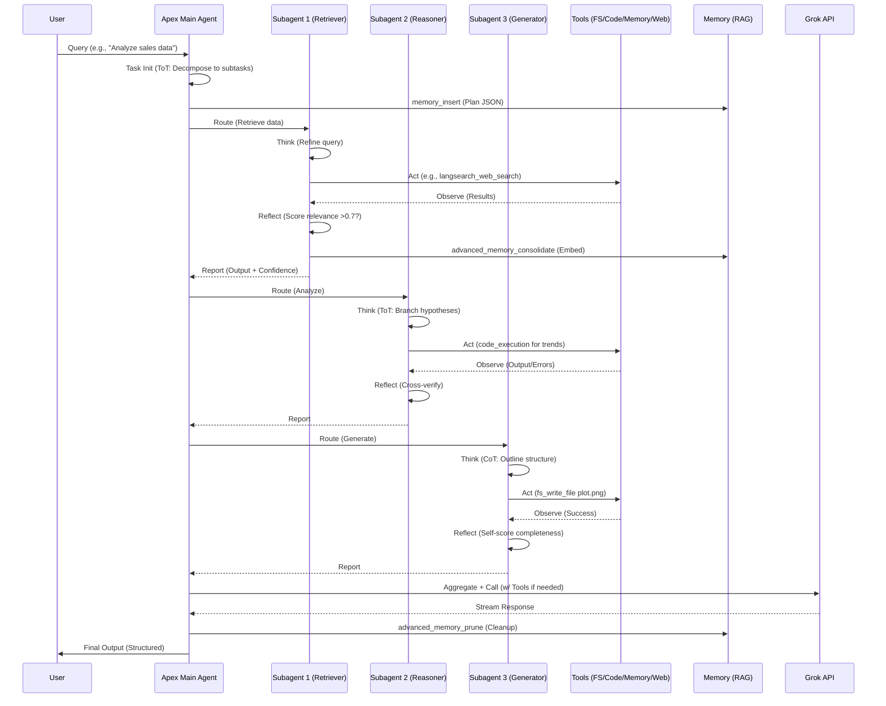
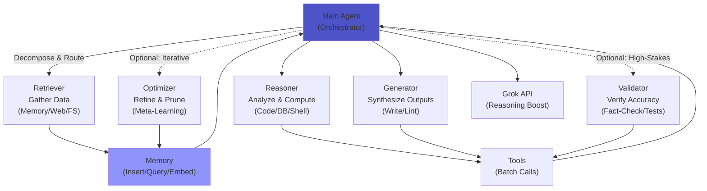
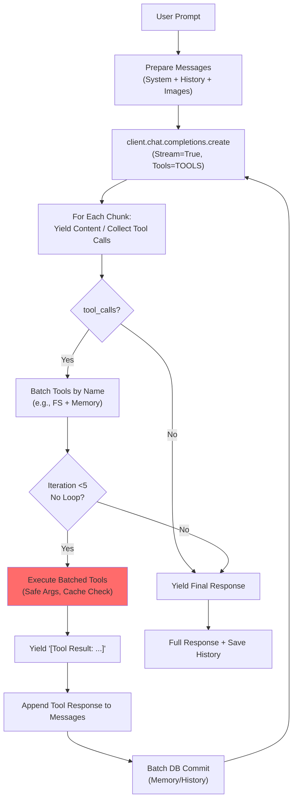

# Apex Ωrchestrator

[](https://github.com/buckster123/ApexOrchestrator/)
[](https://github.com/buckster123/ApexOrchestrator/)
[](https://opensource.org/licenses/MIT)
[](https://www.python.org/downloads/)
[](https://streamlit.io/)
[](https://www.raspberrypi.com/products/raspberry-pi-5/)
[](https://x.ai/)

- **Agents for Everyone**: A $200 Raspberry Pi 5 setup + xAI API key = Your personal open-source RAG-powered AI agent platform. Run autonomous, tool-equipped agents locally with sandboxed execution, vector memory, and ReAct reasoning—all without cloud lock-in.

<div align="center">
  
</div>

## 🚀 Quick Start

Transform your Raspberry Pi 5 into a full-fledged AI agent hub in under 10 minutes. Apex Orchestrator is a Streamlit-based chat app that powers **Apex**, a versatile ReAct-style agent for tasks like code generation, data analysis, web research, and file management. It's designed for edge computing: low-cost, privacy-focused, and infinitely extensible.

### Why Apex Ωrchestrator?
- **Affordable Entry**: ~$200 for a Pi 5 (8GB) + peripherals. No GPUs needed—leverages xAI's Grok API for heavy lifting.
- **Open-Source RAG Core**: Hybrid memory (SQLite + ChromaDB vectors) for Retrieval-Augmented Generation (RAG). Semantic search, hierarchical consolidation, and auto-pruning keep your agent's "brain" sharp.
- **Tool Sandbox**: Secure FS ops, Git, DB queries, code REPL, web search— all confined to `./sandbox/`.
- **Multi-Agent Simulation**: Internally simulates 1 main + 3-5 subagents (Retriever, Reasoner, Generator, etc.) for robust task decomposition.
- **Pi-Optimized**: Runs smoothly on ARM64; tested on Raspberry Pi OS (64-bit).

<div align="center">
  
</div>

## 📋 Table of Contents
- [Features](#features)
- [Technical Specifications](#technical-specifications)
- [Architecture & Workflow](#architecture--workflow)
  - [ReAct-Like Workflow Flowchart](#react-like-workflow-flowchart)
  - [Multi-Agent Simulation Diagram](#multi-agent-simulation-diagram)
  - [Python Logic in Mermaid](#python-logic-in-mermaid)
- [Installation & Setup](#installation--setup)
- [Usage Guide](#usage-guide)
- [Deep Dive: The Agent & Platform](#deep-dive-the-agent--platform)
- [Contributing](#contributing)
- [License](#license)
- [Roadmap](#roadmap)

## ✨ Features

| Feature | Description | Benefits |
|---------|-------------|----------|
| **ReAct Reasoning** | Cycles through Think-Act-Observe-Reflect for autonomous task solving. | Reduces hallucinations; handles complex, multi-step queries. |
| **RAG Memory System** | SQLite for key-value + ChromaDB for vector embeddings (all-MiniLM-L6-v2). | Semantic recall, salience scoring, auto-pruning for efficient long-term memory. |
| **Tool Ecosystem** | 15+ tools: FS (read/write/list/mkdir), code_execution (REPL w/ libs like NumPy/Torch), git_ops, db_query, shell_exec, code_lint (multi-lang), api_simulate, langsearch_web_search. | Sandboxed execution prevents escapes; caching for speed. |
| **Multi-Modal Support** | Image uploads for Grok Vision; streaming responses. | Analyze diagrams, photos, or code screenshots on-device. |
| **User Management** | SQLite-based auth; per-user history & memory. | Multi-user Pi setups with isolated sessions. |
| **Theming & UI** | Neon gradient, dark mode toggle; expandable "Deep Thought" for tool traces. | Immersive, responsive interface. |
| **Edge Deployment** | Pi 5 native; no internet for core ops (API optional for Grok). | Offline-capable with local fallbacks. |

## 🛠 Technical Specifications

### Hardware Requirements
- **Raspberry Pi 5**: 4GB+ RAM (8GB recommended for ChromaDB).
- **Storage**: 32GB+ microSD (for `./chroma_db/` and `./sandbox/`).
- **OS**: Raspberry Pi OS (64-bit, Bookworm or later).
- **Network**: Ethernet/WiFi for API calls (optional for offline mode).
- **Cost Breakdown**: Pi 5 (~$80) + Case/Heatsink (~$20) + Power/SD (~$20) + Peripherals (~$80) = **~$200 total**.

### Software Stack
- **Backend**: Python 3.12 | Streamlit 1.28+ | OpenAI SDK (xAI-compatible).
- **Dependencies**:
  ```
  streamlit
  openai
  passlib
  sqlite3 (built-in)
  python-dotenv
  ntplib
  pygit2
  requests
  black
  numpy
  sentence-transformers
  torch (CPU-only for Pi)
  jsbeautifier
  pyyaml
  sqlparse
  beautifulsoup4
  chromadb
  ```
- **API Integrations**:
  - **xAI Grok**: Core LLM (grok-3/grok-4; free tier limited).
  - **LangSearch**: Web search (optional API key).
- **Persistence**:
  - `chatapp.db`: Users, history, hybrid memory (WAL mode for concurrency).
  - `./chroma_db/`: Vector store (cosine similarity).
  - `./sandbox/`: Tool workspace.
  - `./prompts/`: Custom system prompts.

### Performance Metrics (Pi 5, 8GB)
| Metric | Value | Notes |
|--------|-------|-------|
| **Startup Time** | <5s | Includes DB/Chroma init. |
| **Query Latency** | 2-10s | Streaming; tools add 1-3s each. |
| **Memory Usage** | 500MB-1GB | Peaks during embeddings. |
| **Tool Throughput** | 5-10/min | Batched calls; 5-iteration limit. |
| **Storage Growth** | 10MB/session | Pruned weekly. |

## 🏗 Architecture & Workflow

Apex Orchestrator follows a modular, ReAct-inspired architecture: User input → Agent Orchestration (multi-subagent sim) → Tool Execution → RAG-Augmented Response. All ops are sandboxed and cached for efficiency.

### ReAct-Like Workflow Flowchart

The core loop integrates ReAct (Reason + Act) with CoT/ToT for planning. Here's a Mermaid sequence diagram:



### Multi-Agent Simulation Diagram

Mermaid graph showing subagent hierarchy:



### Python Logic in Mermaid

Core API call loop (from `call_xai_api` function) as a flowchart:



## 📦 Installation & Setup

### Prerequisites
- Raspberry Pi 5 with Raspberry Pi OS (64-bit).
- Python 3.12+ (pre-installed on Pi OS).
- Git: `sudo apt update && sudo apt install git`.

### Step-by-Step Setup
1. **Clone the Repo**:
   ```
   git clone https://github.com/yourusername/apex-orchestrator.git
   cd apex-orchestrator
   ```

2. **Create Virtual Environment**:
   ```
   python -m venv venv
   source venv/bin/activate  # On Pi OS
   ```

3. **Install Dependencies**:
   ```
   pip install -r requirements.txt
   ```
   *Note*: Torch is CPU-only for Pi; no CUDA.

4. **Configure Environment**:
   Create `.env`:
   ```
   XAI_API_KEY=your_xai_grok_api_key_here  # From x.ai
   LANGSEARCH_API_KEY=your_langsearch_key_here  # Optional for web search
   ```
   *Free Tier*: Grok-3 has quotas; upgrade for unlimited.

5. **Run the App**:
   ```
   streamlit run app.py
   ```
   Access at `http://localhost:8501` (or Pi IP:8501 from another device).

6. **First Launch**:
   - Register/login.
   - Upload images or enable tools via sidebar.
   - Select prompt (e.g., `tools-enabled.txt`).

### Troubleshooting
- **ChromaDB Fails**: Ensure `./chroma_db/` is writable; fallback to SQLite.
- **NTP Sync**: Install `ntp` for precise time.
- **ARM64 Issues**: All libs are compatible; test with `python -c "import torch"`.

## 🎮 Usage Guide

### Basic Chat
- Login → Select model (e.g., grok-3) → Type query.
- Example: "Write a Python script for Fibonacci."

### Advanced: Agent Tasks
- Enable tools → Use ReAct prompts: "Think step-by-step: Research quantum computing trends."
- Outputs: Streams in "Deep Thought" expander; final in chat bubble.
- Sandbox: Files auto-save to `./sandbox/`; view via `fs_list_files("")`.

### Custom Prompts
- Edit in sidebar → Save as `.txt` in `./prompts/`.
- Pro Tip: Append "Use ReAct + batch tools" for efficiency.

### History & Memory
- Search/load chats from sidebar.
- Agent auto-consolidates: "Remember this analysis" → Semantic embed.

## 🔍 Deep Dive: The Agent & Platform

### The "$200 Pi-5 Setup + API Key Only" Concept
Apex Orchestrator democratizes AI agents: No PhD, no datacenter—just a Pi 5, a $10 API key, and open-source code. It's RAG at the edge: Retrieve (web/memory), Augment (tools), Generate (Grok-powered). Run it headless as a service (`nohup streamlit run app.py &`) for a personal AI butler. Privacy? All local except API calls. Scalable? Cluster Pis via Docker Swarm for multi-agent swarms.

### Apex: The ReAct-Like Agent
**Apex Orchestrator** is a simulated multi-agent system in one LLM call. Core: **ReAct** (Yao et al., 2022) for grounded reasoning—**Think** (plan via CoT/ToT), **Act** (tool call), **Observe** (parse output), **Reflect** (score <0.7? Retry). 

- **Why ReAct?** Breaks loops: Batches tools (e.g., read + execute + write in one iter); limits to 5 cycles.
- **RAG Integration**: Before acting, `advanced_memory_retrieve` pulls top-k similar contexts (cosine sim). Consolidate post-task: Episodic (full log) + Semantic (Grok-summary) hierarchy.
- **Subagents**: Internal personas (no extra API cost):
  - **Retriever**: Semantic/web fetch (e.g., `langsearch_web_search` w/ freshness="oneWeek").
  - **Reasoner**: Compute branches (e.g., `code_execution` for sims).
  - **Generator**: Artifact creation (e.g., lint + write Markdown reports).
  - **Validator/Optimizer**: Optional for verification/pruning.
- **Stability**: Confidence scores, error fallbacks (e.g., NTP fail → local time), loop detection (no progress? Abort).

**Philosophy**: "Agents for Everyone"—modular, auditable, fun (e.g., "LOVE <3" in writes). Extend via new tools in `TOOLS` schema.

### Platform as RAG Hub
- **Hybrid Memory**: SQLite (fast KV) + Chroma (vectors) = O(1) queries + semantic recall.
- **Sandbox Security**: Path normalization; whitelists; no `shell=True`.
- **Extensibility**: Add prompts/tools; fork for domain-specific (e.g., IoT agents).

## 🤝 Contributing

1. Fork → Branch (`git checkout -b feature/x`).
2. Commit (`git commit -m "Add Y"`).
3. PR to `main`.

Guidelines: Black formatting; test on Pi; update README badges.

## 📄 License

MIT License—use freely, attribute if sharing.

## 🗺 Roadmap

- [x] Pi 5 Optimization (v1.0).
- [ ] Docker Compose for Clusters.
- [ ] Offline LLM (e.g., Llama.cpp).
- [ ] Voice Mode (Pi Mic integration).
- [ ] Agent Marketplace (shareable prompts/tools).

<div align="center">
  <p><em>Built with ❤️ by xAI enthusiasts. Star us on GitHub!</em></p>
</div>
