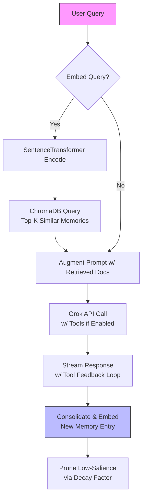

# Apex Orchestrator: Raspberry Pi 5-Powered RAG AI Agent

[](https://github.com/yourusername/picoder) [](https://opensource.org/licenses/MIT) [](https://www.python.org/) [](https://streamlit.io/)

> *Because who needs a data center when your pocket-sized Pi can summon AI overlords? Apex Orchestrator turns your Raspberry Pi 5 into a self-contained RAG (Retrieval-Augmented Generation) powerhouse—chat, code, search, and orchestrate like a boss. Expandable, sandboxed, and nerd-approved. 🚀*

Apex Orchestrator is a standalone AI agent platform hosted on Raspberry Pi 5, leveraging xAI's Grok models for intelligent, tool-augmented conversations. It's built for tinkerers, coders, and mad scientists who want local-first AI with global smarts. No Kubernetes drama—just pure Pi magic.

Key highlights:
- **RAG-Infused Memory**: Semantic search over chat history and docs via ChromaDB embeddings.
- **ReAct Multi-Agent Simulation**: Orchestrate sub-agents (Retriever, Reasoner, Generator) for robust task handling.
- **Sandboxed Tools**: File ops, code execution (with NumPy/SymPy/Torch), Git, web search—all confined to your Pi.
- **Pi-Optimized**: Runs buttery-smooth on Pi 5's 8GB RAM; WAL-mode SQLite for concurrency without hiccups.
- **Nerd Perks**: Vision support, code linting for 10+ languages, NTP-synced timestamps (because accuracy > approximations).

## 🚀 Quick Start

### Prerequisites
- Raspberry Pi 5 (8GB recommended for embeddings).
- Python 3.12+.
- xAI API key (free tier works for Grok-3-mini).
- Optional: LangSearch API key for web tools.

### Installation
1. Clone the repo:
   ```
   git clone https://github.com/buckster/Apex-Orchestrator.git
   cd picoder
   ```

2. Set up virtual env and deps (Pi-friendly; no heavy installs):
   ```
   python -m venv venv
   source venv/bin/activate  # On Pi: use bash
   pip install -r requirements.txt
   ```
   *requirements.txt* (auto-generated from script):
   ```
   streamlit==1.38.0
   openai==1.51.0
   passlib[bcrypt]==1.7.4
   python-dotenv==1.0.1
   ntplib==0.6.5
   pygit2==1.14.1
   requests==2.32.3
   black==24.8.0
   numpy==1.26.4
   sentence-transformers==3.1.1
   torch==2.4.1  # CPU-only for Pi
   jsbeautifier==1.15.1
   pyyaml==6.0.2
   sqlparse==0.5.1
   beautifulsoup4==4.12.3
   chromadb==0.5.11
   ```

3. Config (.env):
   ```
   XAI_API_KEY=your_xai_key_here
   LANGSEARCH_API_KEY=your_langsearch_key_here  # Optional for web search
   ```

4. Fire it up:
   ```
   streamlit run Apex-Orchestrator.py --server.port 8501
   ```
   Access at `http://raspberrypi.local:8501` (or Pi's IP).

### First Run
- Register/login (SQLite-backed users).
- Select a prompt (e.g., "tools-enabled.txt" for agent mode).
- Chat away! Enable tools in sidebar for file/code wizardry.

Pro Tip: On Pi, overclock to 2.7GHz for Grok-4 dreams (but watch thermals—your Pi's not a volcano).

## 🎯 Features

| Feature | Description | Nerd Factor |
|---------|-------------|-------------|
| **Streaming Chat** | Real-time Grok responses with tool loops (max 3 iterations to dodge infinite recursion). | Handles vision uploads—analyze Pi cam snaps mid-convo. |
| **Advanced Memory (EAMS)** | Hierarchical storage: Episodic (raw logs) + Semantic (Grok-summarized) via ChromaDB. Prune low-salience entries like a digital Marie Kondo. | Embeddings with all-MiniLM-L6-v2; cosine sim for relevance boosts. |
| **Tool Arsenal** | 15+ sandboxed tools: FS ops, REPL code exec, Git, DB queries, linting, mock APIs, web search. | Stateful REPL persists vars—build a NumPy sim across turns. |
| **Multi-Agent Orchestrator** | Simulate Apex Orchestrator: ReAct/CoT/ToT with sub-agents (Retriever, Reasoner, etc.). Self-checks confidence scores. | ToT branching prunes paths; memory as shared state—feels like a mini-LangChain on steroids. |
| **UI Polish** | Neon-gradient theme, dark mode toggle, chat bubbles, history search. | Custom CSS for Pi's tiny screen; expander for "deep thoughts" (tool traces). |
| **Expandability** | Add prompts to `./prompts/`, extend TOOLS list, hook custom sub-agents. | YAML/JSON configs; plugin-like tool schema for easy swaps. |

Humor Alert: If you ask it to "commit" bad code, it'll Git it done... with a diff roast. 😏

## 🏗️ Architecture & Flows

PiCoder's brain is a RAG-enhanced ReAct loop, all local except API calls. Here's the magic in diagrams (Mermaid—GitHub renders 'em natively).

### RAG Flow: Augmenting Generation with Memory


- **Why RAG?** Fights hallucinations by pulling from your chat history/docs. Semantic summaries keep it snappy.

### ReAct Flow: Reasoning + Acting in Agent Mode
```mermaid
graph LR
    Q[Query: "Analyze CSV Trends"] --> P[Plan: ToT Decompose<br/>Subtasks: Retrieve → Reason → Generate]
    P --> S1[Subagent 1: Retriever<br/>Think: Refine Query<br/>Act: fs_read_file + advanced_memory_retrieve<br/>Observe: Parse Data<br/>Reflect: Relevance Score >0.7?]
    S1 --> S2[Subagent 2: Reasoner<br/>Think: Branch Hypotheses (CoT)<br/>Act: code_execution (NumPy Trends)<br/>Observe: Outputs/Errors<br/>Reflect: Verify w/ Alt Branch]
    S2 --> S3[Subagent 3: Generator<br/>Think: Structure Output<br/>Act: code_lint + fs_write_file (Plot)<br/>Observe: Draft Review<br/>Reflect: Coherent?]
    S3 --> V{Optional Validator?<br/>High-Stakes?}
    V -->|Yes| S4[Subagent 4: Validator<br/>Act: langsearch_web_search (Fact-Check)<br/>Reflect: Confidence <0.7? Retry]
    V -->|No| A[Aggregate: Merge Outputs<br/>w/ Confidence Weights]
    A --> O[Output: Summary + Artifacts<br/>Cleanup: advanced_memory_prune]
    style Q fill:#ff9,stroke:#333
    style O fill:#9f9,stroke:#333
```

- **ReAct Loop**: Cycles Think-Act-Observe-Reflect per sub-agent. Caps at 5 cycles—because even AIs need coffee breaks.
- **Multi-Agent Sim**: No extra processes; all in one Grok call via structured tools. Scalable to 5 sub-agents for epic quests.

## 🛠️ Customization & Expansion

- **Prompts**: Drop .txt files in `./prompts/` (e.g., "coder.txt" for dev mode). Edit/save via UI.
- **Tools**: Extend `TOOLS` list in script—add schemas for new functions (e.g., Pi GPIO integration).
- **Memory**: Tune ChromaDB path; add salience decay for long-running bots.
- **Pi Tweaks**: For headless: `streamlit run app.py --server.headless true`. Monitor with `htop`—Grok-3-mini sips ~500MB.

Want to fork for IoT? Hook `code_execution` to RPi.GPIO. The sandbox awaits.

## 🤝 Contributing

1. Fork & PR.
2. Lint: `black . && isort .`.
3. Test: `pytest` (add tests dir for REPL mocks).
4. Pi-Test: Run on real hardware—emulators lie.

Issues? Open one. Stars? Fuel the Pi. <3

## 📄 License

MIT—use it, tweak it, Pi it.

---

*Built with ❤️ on a Pi 5. Questions? Ping @AndreBuckingham. May your embeddings cluster tightly and your loops never infinite.*
